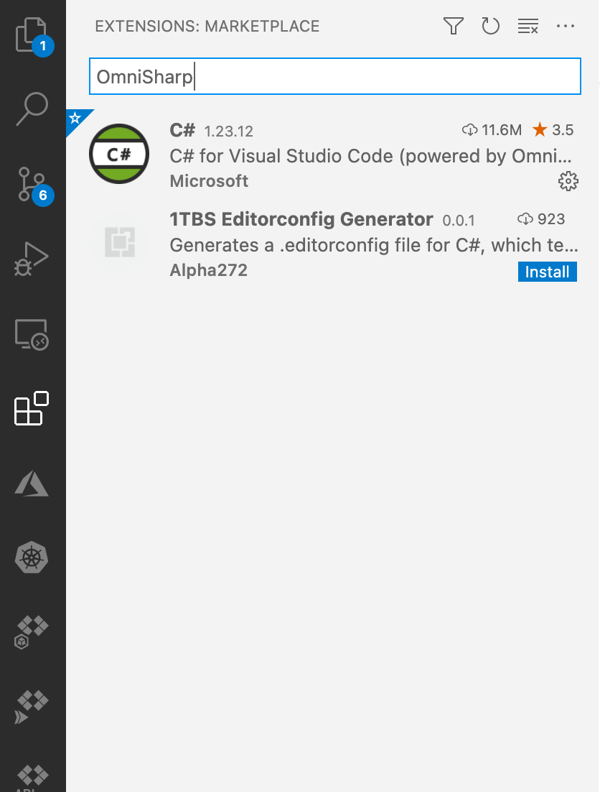
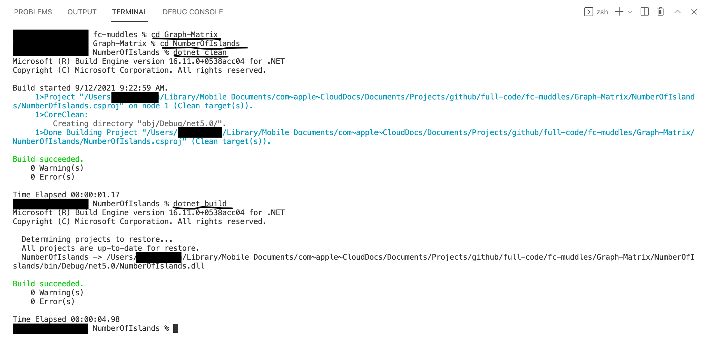

## Muddles

Keeping the Computer Science 101 Brain.

In an effort to crack through the interview process, the number of problems that a developer must know and understand is overwhelming.  It feels like a chaotic muddle of problems that you must know. Frankly, it is hard to determine if a Software Engineer is good at being a Software Engineer if the basis of the hiring is determined by the success of solving a problem from a site like LeetCode or HackerRank. So, this is a personal effort by me to organize my thoughts and solve some problems.

So what I will be covering in this REPO and on [my site](https://www.iamfullcode.net) is the following concepts.

1. Algorithms
2. Data Structures
3. Arrays
4. Time and Space Complexities
5. Problem Solving Strategies

The problems will be mainly drawn from [LeetCode](https://leetcode.com).


## Project Requirements
The Solution is a Visual Studio Code collection of Projects. I mainly use this on a Macbook Pro, but given the nature of the cross platform capabilities of Visual Studio Code, this can be used on  Windows, Macbooks and Linux. **This is not a tutorial on installing DotNet and Visual Studio Code, so I am not providing those specifics.** However, you can use the shell command file on the Mac, and Windows(bash window with [Git Install](https://git-scm.com/book/en/v2/Getting-Started-Installing-Git))

Requirements:
1. [Visual Studio Code Download](https://code.visualstudio.com/download)
2. [DotNet Download](https://dotnet.microsoft.com/download) that you can use to download DotNet. This includes all environments
   - For those that use Macbook you can use Homebrew to install the latest version of Dotnet.  ([Homebrew Install](https://formulae.brew.sh/cask/dotnet)) 
3. Install the C# DevKit for Visual Studio Code
[C# DevKit](https://marketplace.visualstudio.com/items?itemName=ms-dotnettools.csdevkit)



## Project Creation
Use the following files for creating your projects:
1. Open a Terminal Window from Main Menu -> Terminal -> Terminal. I use zsh Shell on my MacBook. So it allows me to run Shell Scripts, and perform GIT operations all in the same Terminal Window. In Windows you will use the BASH terminal.
   
2. Macbook and Windows: Use mac-create-project.sh to run a Shell script that will prompt you for a project name to create in dotnet. This Shell file is simply a series of dotnet commands. **Insure your shell window is executing in the directory where the Shell file exists.**
3. Enter the project name of choice(with the relative path of the folder it will be created in) and the project will be added to the folder. In our example we are going to create a folder called Graph-Matrix, and then create a project in that folder. 


 Run the Shell Command indicated in the screen shot below.
 ```shell
      sh mac-create-project.sh
 ```
   

The command is really simple in creating a project. However, you need to be organized and have your work in a single working folder as I have in this example. Run the commands to create your projects from the ROOT of your working folder, and as you create projects they will be created in the specified folders that you create when you enter the relative path in the **Enter the project name:** prompt.

**Sample Syntax**
``` cmd
  dotnet new console -o "YourProjectName"
```

4. Navigate to the folder and attempt to build the project with the following commands
  - dotnet clean
  - dotnet build
  


I have underlined **Change Directory** commands, the command **dotnet clean** and **dotnet build** commands below. When you execute these commands, the dotnet compiler will clean any compiled code from the .NET Bin folder, and then build them again.


5. Debugging the project. Follow the steps below. Note that as you add projects to your solution then you will have change the DLL reference in the **lauch.json** file that is auto created in the following steps. This is how the debugger in the environment knows what to DEBUG.


## Debugging Steps

1. Run the Debugger
   

2. When you do the initial debug operation you will be prompted to create a **launch.json** file. Select the option to create a launch.json file.


3. The options list that will appear will give you several options. You will chose .NET Core


4. You will have several new files created in a .vscode folder. These files are **launch.json** and **tasks.json**. We will be looking at the **launch.json** for future debug operations of other projects that we will add to this solution. When debugging a specific project, you will make the changes in the **launch.json** file and you will be able to debug just the specified project. When you are ready to debug another project, you will have to update the settings specified in the call-outs below.
   


You are now ready to debug the first solution. In this example we are going to be debugging the NumberOfIslands Project. If your Terminal window is at the ROOT of your solution then you need to be sure you are in the ROOT of the project you are going to be debugging.

## IMPORTANT DEBUG NOTE: 
Sometimes during debugging, the debugger gets confused when you make changes to your C# files. When your run **dotnet clean**, and then **dotnet build** the debugger sometimes will not work. What I found to fix this issue is to issue a **dotnet build** operation multiple times. This seems to fix any references the debugger engine has. 

